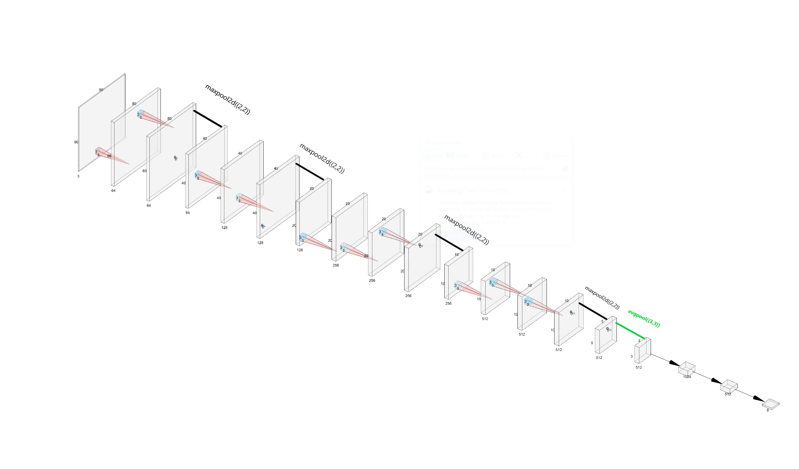
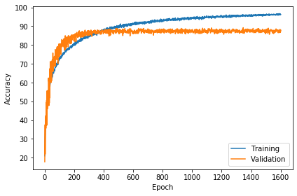
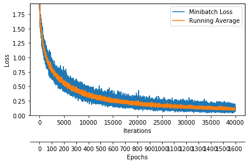
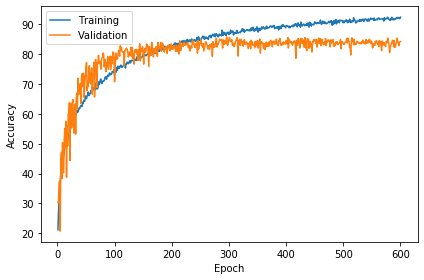
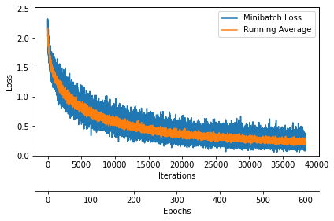
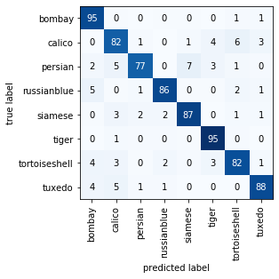
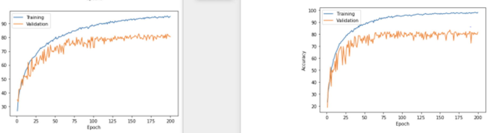

# COMP9444 Neural Networks and Deep Learning

A Pytorch neural networks model for cat breed classification

* description: https://www.cse.unsw.edu.au/~cs9444/21T3/hw2/

* data.zip: https://www.cse.unsw.edu.au/~cs9444/21T3/hw2/hw2.zip

## Project set up

### Set up and activate Virtual environment

```shell
python3 -m venv ./venv
source ./venv/bin/activate
```

### Installing dependencies

```shell
pip install -r ./requirements.txt
```

## Term 3, 2021

### Project 2 - Cat Breed Classification

### Submitted by

* Abrar Amin (z5018626)
* Demiao Chen (z5289988)
* Group ID - g025514

### 1 Choice of architecture

#### 1.1 First approach - Simple Convolutional Network

We first took our basic ConvNet we used for the KMNIST classification task in assignment 1 and made no changes to other hyper parameters. This composed of 3 convolution layers followed by 3 fully-connected layers with 150 nodes in each layer followed by an output layer of size 8 (8 breeds of cat).

We noticed that after 50 epochs, training accuracy using this very basic model would reach close to 100% however validation set accuracy would get stuck at below 50% and not improve with more epochs. We decided this would be used as a baseline to compare our subsequent models against.

#### 1.2 Final approach - Modified version of VGG (VGG-13)

We went on to exploring architectures that performed well in ImageNet competition. We looked at 3 architectures in particular that gained a lot of attention -

* AlexNet (2012)
* VGG (2014)
* ResNet (2015)

While we implemented all 3 of these architectures for our problem (see 1.3 Analysis) Our final solution was based on the VGG-16 architecture which was a submission by the **VGG team** in the 2014 ImageNet Competition (Simonyan R. & Zisserman A., 2014).

VGG is an abbreviation of for Visual Geometry Group at Department of Engineering Science, Oxford University (Robots.ox.ac.uk., 2021). One of the key findings of the VGG architecture is for several layers of deep convolution networks with narrow filters worked better than fewer layers with wider filters (Zhang et al., 2021). The filter size used for VGG for all convolution layers was only `3*3`.

#### 1.2.1 Architecture Details

**Architecture Text View**

```python
vgg_13 = [64, 64, 'maxpool', 128, 128, 'maxpool', 256, 256, 256, 'maxpool', 512, 512, 512, 'maxpool', 'avgpool', 'fc1', 'fc2', 'fc3']
```

**Architecture Diagram**



Figure 1a: VGG-13 Architecture

We generated the architecture diagram for our VGG-13 model using [this online tool](http://alexlenail.me/NN-SVG/AlexNet.html).

**Architecture Parameters**

| Action       | Weights | Bias | Trainable Parameters |
| ------------ | ------- | ---- | -------------------- |
| Conv2d       | 1728    | 64   | 1792                 |
| BatchNorm2d  | 64      | 64   | 128                  |
| Conv2d       | 36864   | 64   | 36928                |
| BatchNorm2d  | 64      | 64   | 128                  |
| Conv2d       | 73728   | 128  | 73856                |
| BatchNorm2d  | 128     | 128  | 256                  |
| Conv2d       | 147456  | 128  | 147584               |
| BatchNorm2d  | 128     | 128  | 256                  |
| Conv2d       | 294912  | 256  | 295168               |
| BatchNorm2d  | 256     | 256  | 512                  |
| Conv2d       | 589824  | 256  | 590080               |
| BatchNorm2d  | 256     | 256  | 512                  |
| Conv2d       | 589824  | 256  | 590080               |
| BatchNorm2d  | 256     | 256  | 512                  |
| Conv2d       | 1179648 | 512  | 1180160              |
| BatchNorm2d  | 512     | 512  | 1024                 |
| Conv2d       | 2359296 | 512  | 2359808              |
| BatchNorm2d  | 512     | 512  | 1024                 |
| Conv2d       | 2359296 | 512  | 2359808              |
| BatchNorm2d  | 512     | 512  | 1024                 |
| FC Layer 1   | 4718592 | 1024 | 4719616              |
| BatchNorm    | 1024    | 1024 | 2048                 |
| FC Layer 2   | 524288  | 512  | 524800               |
| BatchNorm    | 512     | 512  | 1024                 |
| Output Layer | 4096    | 8    | 4104                 |

<u>Total Trainable Parameters</u> = 12892232

#### 1.2.2 Convolution Layers

The VGG architecture consisted of VGG-blocks. **Within** each block the width of the output is maintained. This is done by using a `3*3` filter **after** adding a padding of size 1. We also make use of Batch Normalisation to avoid the problem of shrinking and exploding gradient, and then we apply an activation function. For our implementation we use ELU (Exponential Linar Unit). Within each VGG-block number of channels is the same.

After each VGG-block we use **MaxPooling** with kernel size `2*2` and stride of `2` as defined on the paper. Due to size constraints we had to remove the 5th VGG-block that is present in VGG-16 from our implementation, reducing 3 convolution layers.

#### 1.2.3 Average Pooling

We used **Adaptive Average Pooling** provided to us by PyTorch, shrinking our final output from the convolution layers from `5*5` to `3*3`. This also helped us ensure the input to the Fully Connected layers were of a fixed size while we experimented with the Convolutional Layers during development.

#### 1.2.4 Fully Connected Layers

We reduced the number of neurons from the two hidden FC layers from 4096, 4096 to 1024 and 512 respectively due to size constraints of the project, and the final output layer was of size 8 (number of cat breeds). We made use of dropout (to reduce overfitting) and batch normalization in the FC layers.

### 1.3 Model Analysis

We noticed that our implementation of VGG-13 outperformed our ResNet-18 implementation. We used a 80-20 training to validation set split on the available test data and observed the following for the training and test accuracy and loss.

#### VGG-13 Performance




Figure 1b: VGG-13 Performance (600 epoch)

#### ResNet-18 Performance




Figure 1c: ResNet-18 Performance (600 epoch)

Note: Plots were generated using these [open source helper functions](https://github.com/rasbt/stat453-deep-learning-ss21/blob/main/L13/code/helper_plotting.py).

#### Model Comparison

One possible reason of why our VGG-13 got higher accuracy (88%) on the validation set in comparison to ResNet-18 (84%) was due to the additional layers on ResNet-18 it was more prone to overfitting as we can see on the diagram. A simpler implementation of ResNet with lower number of convolution layers is likely to have performed better. These results were a significant improvement to our starting point using a basic 3-layer convolutional network.

Due to the higher validation set accuracy we decided to submit our VGG-13 implementation. Our unsubmitted ResNet-18 implementation can be found on this [Secret Gist on GitHub](https://gist.github.com/abraramin/81d4f0e2be95a5dea055581b6ebb5d56).

We converted the Confusion Matrix output for our VGG-13 model into percentage (%):



Figure 1d: VGG-13 Confusion Matrix (after training 600 epoch)

We can see our model performs really well for Bombay, Tiger, Tuxedo, Siamese and Russian Blue breeds and it makes more mistakes for Persian, Calico and Tortoiseshell classification. 7% instances of Persian are misclasssified as Siamese and 6% of Calico are misclassified as Tortoiseshell. Observing the training examples many of these breeds look visually very similar.

### 2 Loss Function, Optimizer and Tuning Metaparameters

We chose to stick with Cross Entropy Loss function as it seems to be commonly used in classification problems such as this one.

We experimented using Stochastic Gradient Descent (SGD) and Adaptive Moment Estimation (Adam) as the optimizers for our model. We observed that Adam performed better and was converging to global minimum faster when testing our model.

We experimented with learning rates 0.01, 0.001 and 0.0005. We found that 0.0005 worked best for our optimizer, hence this was chosen for the final submission.

We plotted the training vs test accuracy for our VGG-13 model and we noticed that after 400 epoch test accuracy plateaus and we don't observe any noticable improvements (Refer to figure 1b). Theoretically there should be negligible difference in test accuracy if our model is **trained past 400 epochs**, we see that our model starts overfitting beyond this point.

The saved model used in our **final submission** was trained for 1500 epoch using a batch size of 256 for which we used all of the data provided to us for training (without a validation set, as this was our final submission).

### 3 choice of image transformations

We explored several combinations of transformations for augmenting data. As we were only provided 8000 images of cats, and we found it very easy to overfit the data, where in a 80-20 train-validation set, we get nearly 100% trancing accuracy but only around 65% testing accuracy with a CNN-FC architecture. Therefore, we used transform functions to technically increase the data we have. We initially used the following transform functions for training set:

```python
transforms.Compose(
    [   
        transforms.RandomResizedCrop(size=80, 
                    scale=(0.75, 1.0), ratio=(0.75, 1.3)), 
        transforms.RandomHorizontalFlip(),
        transforms.RandomRotation((-10,10)),
        transforms.ColorJitter(brightness=0.4, contrast=0.3, saturation=0.3, hue=0.2),
        transforms.RandomPosterize(bits=3, p=0.4),
        transforms.RandomEqualize(p=0.1),
        transforms.RandomGrayscale(p=0.1),
        transforms.RandomPerspective(distortion_scale=0.05, p=0.1, fill=0),

        transforms.ToTensor()
    ]
)
```

But in our best model, the training accuracy went up to 96% but testing accuracy kept bouncing around 80%. Therefore, we think the data augmentation is still not good enough to overcome overfitting, and used much more strong parameters (higher probability, rotation range, effect range) for transform functions, but decrease parameters for some transform functions like hue in  ColorJitter (decrease from 0.2 to 0.02) and p for RandomGrayscale (decrease from 0.1 to 0.01), because we think color of cats is very crucial for breed classifications, make less changes of color for training data set helps machine to classify cat breed correctly, and it successfully increased the testing accuracy from 80% to 88%, although it takes more epochs to train, this is because augmented more data of cats, it takes machine more time to look all of them. The enhanced transform for training data follows:

```python
transforms.Compose(
        [   
            transforms.RandomResizedCrop(size=80, scale=(0.55, 1.0), ratio=(0.75, 1.3)),
            transforms.RandomHorizontalFlip(),
            transforms.RandomPerspective(p=0.2),
            transforms.RandomAffine(degrees=(-15, 15), translate=(0.0, 0.5)),
            transforms.RandomRotation((-10,10)),
            transforms.ColorJitter(brightness=0.4, contrast=0.4, saturation=0.1, hue=0.02),
            transforms.RandomPosterize(bits=3, p=0.3),
            transforms.RandomEqualize(p=0.1),
            transforms.RandomGrayscale(p=0.01),
            transforms.RandomPerspective(distortion_scale=0.05, p=0.1, fill=0),
            transforms.RandomAdjustSharpness(sharpness_factor=2, p=0.5),
            transforms.ToTensor()
        ]
    )
```

For testing data transforms, we did not apply any data augmentation, this is to ensure machine used the original clean data to get the correct accuracy.

### 4 Improvements to generalization

#### **validation set**

We used 80-20 training validation data distribution (80% data used to training, 20% data used to do validation). And we used plot technique to see in what accuracy the training accuracy continues to grow but validation accuracy hardly improve. Therefore, the 20% validation helped us to monitor the overfitting of our model as well as the true accuracy of our model. We used the validation accuracy to select the best model, which in the one gives the highest testing accuracy.

Before submission, we let the code go through all data set to get trained by more data.

#### **choice of activation functions**

We explored several activation functions: ReLU, LeakyReLU and ELU. We found that using ELU in the convolutional layers gives less fluctuation of testing accuracy. A comparison of ELU (left) and ReLU (right) follows:



It clearly shows that ELU gives more stability of testing accuracy after epoch 100 while their testing accuracy are similar.

### **batch normalisation**

We found that applying batch normalisation in every layer except before the output layer increased the validation accuracy, it helps the generalization of data.

### **dropout**

We found that applying `dropout()` function in the fully connected layers after convolutional layers helped reducing overfitting, and we tested severals probability of `dropout()` functions in fully connected layer, benchmark the normal default 0.5 probability for every three layers, the 0.3 0.6 0.3 probability distribution (lower probability of dropout in the output layer and the output from convolutional layers to fully connected layers, higher probability in the middle layer of fully connected layers) works the best.

### 5 Reference

Aston Zhang and Zachary C. Lipton and Mu Li and Alexander J. (2021). Dive into Deep Learning. 7. Modern Convolutional Neural Networks. Retrieved from https://d2l.ai/chapter_convolutional-modern/vgg.html

Robots.ox.ac.uk. (2021). Visual Geometry Group - University of Oxford. [online] Retrieved from: https://www.robots.ox.ac.uk/~vgg/

Simonyan, Karen & Zisserman, Andrew. (2014). Very Deep Convolutional Networks for Large-Scale Image Recognition. arXiv 1409.1556. Retrieved from https://arxiv.org/pdf/1409.1556.pdf
