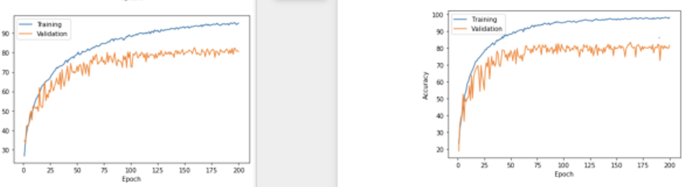

## C. choice of image transformations

We explored several combinations of transformations for augmenting data. As we were only provided 8000 images of cats, and we found it very easy to overfit the data, where in a 80-20 train-validation set, we get nearly 100% trancing accuracy but only around 65% testing accuracy with a CNN-FC architecture. Therefore, we used transform functions to technically increase the data we have. We initially used the following transform functions for training set:
```python
transforms.Compose(
    [   
        transforms.RandomResizedCrop(size=80, 
                    scale=(0.75, 1.0), ratio=(0.75, 1.3)), 
        transforms.RandomHorizontalFlip(),
        transforms.RandomRotation((-10,10)),
        transforms.ColorJitter(brightness=0.4, contrast=0.3, saturation=0.3, hue=0.2),
        transforms.RandomPosterize(bits=3, p=0.4),
        transforms.RandomEqualize(p=0.1),
        transforms.RandomGrayscale(p=0.1),
        transforms.RandomPerspective(distortion_scale=0.05, p=0.1, fill=0),

        transforms.ToTensor()
    ]
)
```
But in our best model, the training accuracy went up to 96% but testing accuracy kept bouncing around 80%. Therefore, we think the data augmentation is still not good enough to overcome overfitting, and used much more strong parameters (higher probability, rotation range, effect range) for transform functions, but decrease parameters for some transform functions like hue in  ColorJitter (decrease from 0.2 to 0.02) and p for RandomGrayscale (decrease from 0.1 to 0.01), because we think color of cats is very crucial for breed classifications, make less changes of color for training data set helps machine to classify cat breed correctly, and it successfully increased the testing accuracy from 80% to 88%, although it takes more epochs to train, this is because augmented more data of cats, it takes machine more time to look all of them. The enhanced transform for training data follows:
```python
transforms.Compose(
        [   
            transforms.RandomResizedCrop(size=80, scale=(0.55, 1.0), ratio=(0.75, 1.3)),
            transforms.RandomHorizontalFlip(),
            transforms.RandomPerspective(p=0.2),
            transforms.RandomAffine(degrees=(-15, 15), translate=(0.0, 0.5)),
            transforms.RandomRotation((-10,10)),
            transforms.ColorJitter(brightness=0.4, contrast=0.4, saturation=0.1, hue=0.02),
            transforms.RandomPosterize(bits=3, p=0.3),
            transforms.RandomEqualize(p=0.1),
            transforms.RandomGrayscale(p=0.01),
            transforms.RandomPerspective(distortion_scale=0.05, p=0.1, fill=0),
            transforms.RandomAdjustSharpness(sharpness_factor=2, p=0.5),
            transforms.ToTensor()
        ]
    )
```
For testing data transforms, we did not apply any data augmentation, this is to ensure machine used the original clean data to get the correct accuracy.

## E. use of validation set, and any other steps taken to improve generalization and avoid overfitting

### **validation set**

We used 80-20 training validation data distribution (80% data used to training, 20% data used to do validation). And we used plot technique to see in what accuracy the training accuracy continues to grow but validation accuracy hardly improve. Therefore, the 20% validation helped us to monitor the overfitting of our model as well as the true accuracy of our model. We used the validation accuracy to select the best model, which in the one gives the highest testing accuracy.

Before submission, we let the code go through all data set to get trained by more data.

### **choice of activation functions**

We explored several activation functions: ReLU, LeakyReLU and ELU. We found that using ELU in the convolutional layers gives less fluctuation of testing accuracy. A comparison of ELU (left) and ReLU (right) follows:



It clearly shows that ELU gives more stability of testing accuracy after epoch 100 while their testing accuracy are similar.

### **batch normalisation**

We found that applying batch normalisation in every layer except before the output layer increased the validation accuracy, it helps the generalization of data.

### **dropout**

We found that applying dropout() function in the fully connected layers after convolutional layers helped reducing overfitting, and we tested severals probability of dropout() functions in fully connected layer, benchmark the normal default 0.5 probability for every three layers, the 0.3 0.6 0.3 probability distribution (lower probability of dropout in the output layer and the output from convolutional layers to fully connected layers, higher probability in the middle layer of fully connected layers) works the best.
